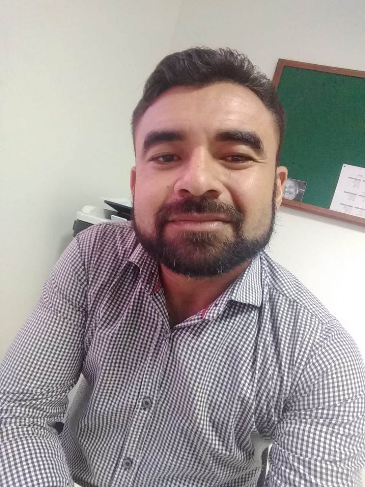

<h1 align="center">Site de portfólio</h1>
<h4 align="center">Clone com modificações</h4>

  O projeto é um clone do site de portfólio, com o intuito de reproduzir a interface, com algumas modificações, aplicando os temas abordados ao longo das aulas de HTML5 e CSS3 da plataforma da <a href="https://b7web.com.br">B7Web. </a> 

  O clone do site de portfólio serve como desafio para os alunos da plataforma testarem seus conhecimentos e colocarem em prática os recursos de HTML5 e CSS3 abordados nos cursos.

<h2 id="topics">📦 Temas abordados</h2>

O projeto possui como intuito aplicar os conceitos abordados no curso de HTML5 e CSS3 da <a href="https://b7web.com.br">B7Web.</a>, ministrado pelo instrutor <a href="https://github.com/bonieky"> Bonieky lacerda.</a>.

Recursos CSS presentes no projeto:

- Fundamentos do HTML5 e CSS3
- Grid Layout
- Flexbox
- Responsividade
- Pseudo-elementos
- Pseudo-classes
- Semântica e CSS Avançado
- Transições e animações
- Tratamento de campos inválidos no formulário

<h2 id="challenges">🏆 Desafio</h2>
Criar um site de portfólio usando ferramentas indicada no curso, e aplicando todos os recursos e conhecimentos adquirido no mesmo referente HTML5 e CSS3.
<h2 id="Aluno">💻 Aluno</h2>

    
    
&nbsp&nbsp&nbspLuide Lima 
      
    &nbsp&nbsp&nbsp<a href="http://instagram">Instagram</a>&nbsp;|&nbsp;<a href="https://github.com/LUIDELIMA">GitHub</a>&nbsp;|&nbsp;<a href="https://www.linkedin.com/in/luide-lima-83599680/">LinkedIn</a>

  

